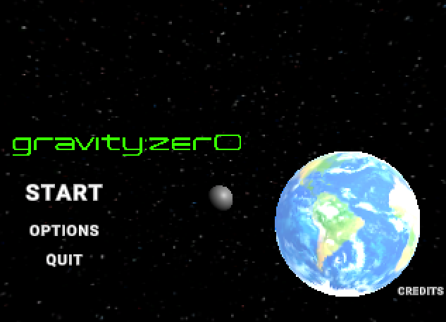

# gravity-zer0
Level Design Project for Term 2 (Due for submission is 4pm via Moodle on Friday of Week 12 (27th March).

We are creating a game that represents the style of PS1/N64, based on the texture filtering and distortion. 
This obviously creates the game look dated and primitive, but it adds the atmosphere and retro feeling.

We attend to downscale, even the textures to around 128x128 to increase the old qualities of the Level/Game.

The Level/Game will be a 3D First Person Platformer, were you must jump, run, etc., to progress further.
